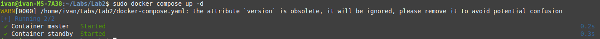
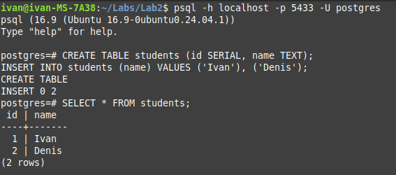
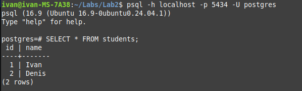
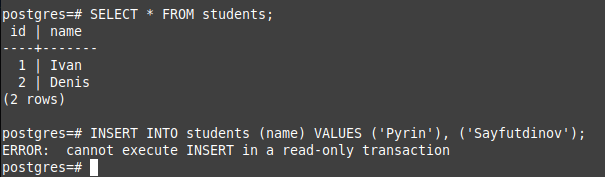
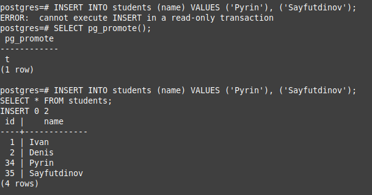

## Лабраторная работа
Поднимаем контейнеры и подключаемся к master
```
sudo docker compose up -d
psql -h localhost -p 5433 -U postgres
```


Создаём таблицу

```
CREATE TABLE students (id SERIAL, name TEXT);
INSERT INTO students (name) VALUES ('Ivan'), ('Denis');
SELECT * FROM students;
```

Подключаемся к standby
```
psql -h localhost -p 5434 -U postgres
```
Проверяем наличие данных

```
SELECT * FROM students;
```



```
INSERT INTO students (name) VALUES ('Pyrin'), ('Sayfutdinov');
```


Останавиваем контейнер master, переводим standby в master

```
docker stop primary
```
```
`SELECT pg_promote();`

INSERT INTO students (name) VALUES ('Pyrin'), ('Sayfutdinov');
SELECT * FROM students;
```


