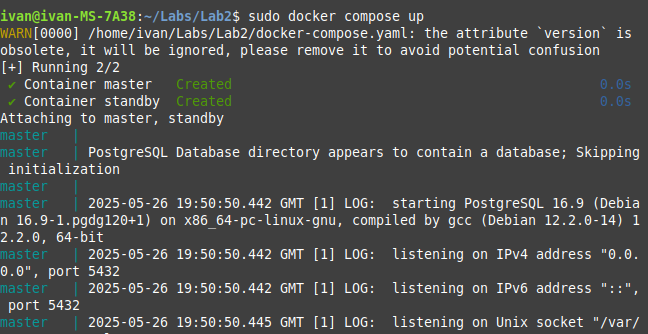
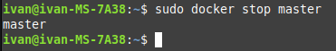
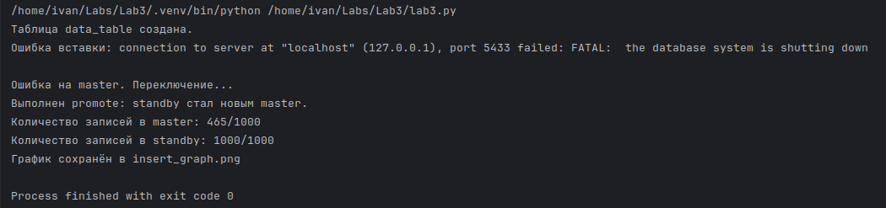
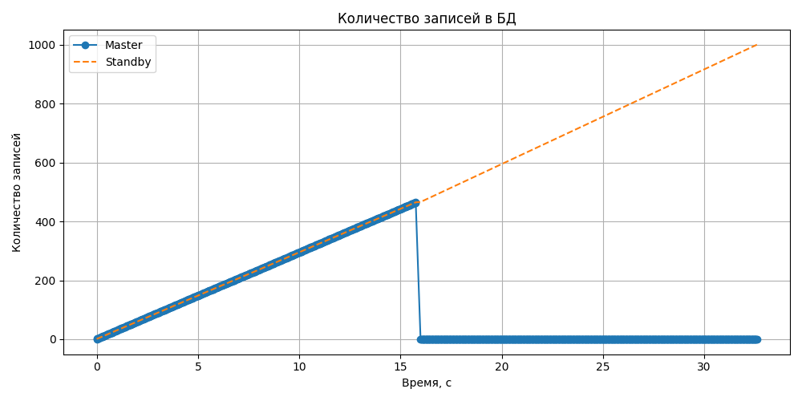

## Лабораторная работа №3
```
uv venv
source .venv/bin/activate
```
```
uv sync
```
```
sudo docker compose up
```

```
sudo docker stop master
```

```
python3 lab3.py
```
```
uv run lab3.py
```


